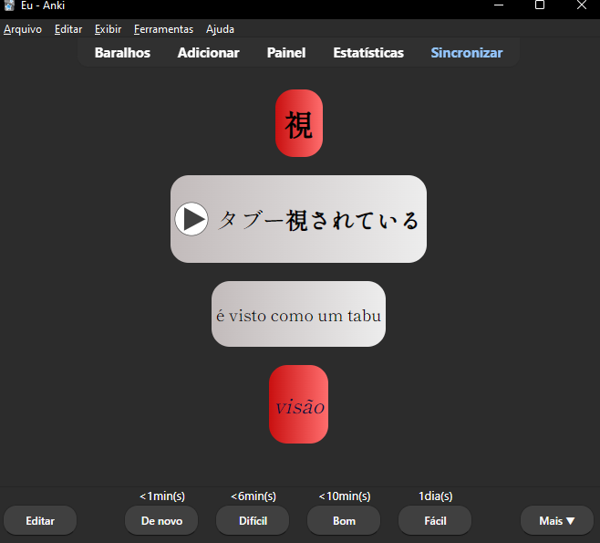

# Japanese-anki-flashcards
An automatic creator of audio on japanese phrases on anki

## What does it do?

This flash card template creates an audio phrase of the content you've written in the second box on anki automatically.

I like to use it adding the word I'm learning on the first box, the phrase on the second, third would be the translation of the phrase and the last box the meaning of the word, like in the image bellow:

## How to install it:

To install, download Anki and the file named as Japanese automation apkg

You may also need to install the awesome tts extension in your anki

You can find it on the link bellow:

https://ankiweb.net/shared/info/1436550454

Have fun! :)
